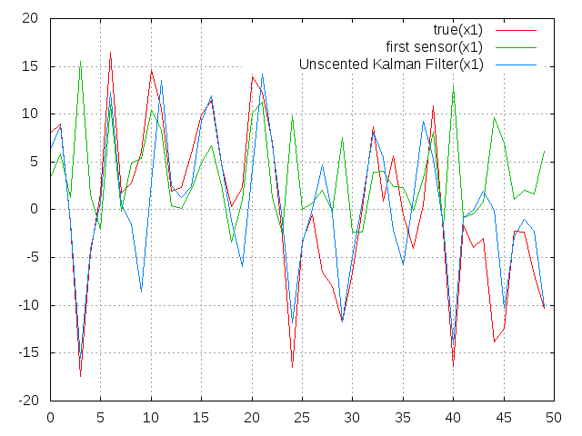

# Unscented Kalan Filter

## How to use

```bash
$ git clone https://github.com/AriYu/unscented_kalman_filter.git
$ mkdir bin && cd bin && cmake .. && make && cd .. && ./test
```
## だいたいこんな感じ


## 参考
- 足立修一，丸田一郎，"カルマンフィルタの基礎", 東京電機大学出版局，p.p.163-185, 2012.
